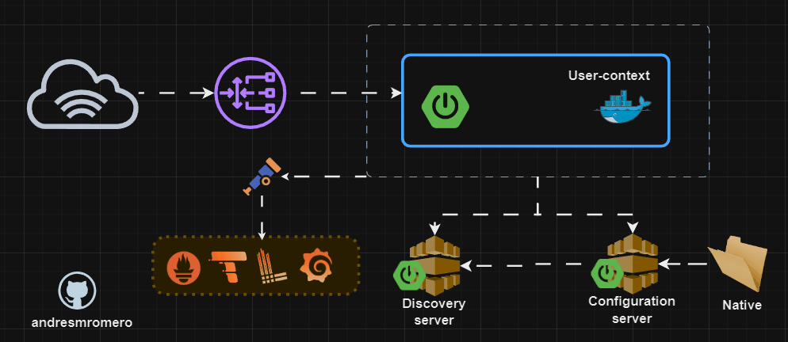

# shop-spring-microservices-clean-arquitecture-ddd-cqrs
## 🔷  Project view

 - **Observability and monitoring:**  OpenTelemetry, Loki, Tempo, Prometheus, and Grafana

## 🔷 Modules

- **User-context:** 

    **Tech Stack:** Spring Boot
  
